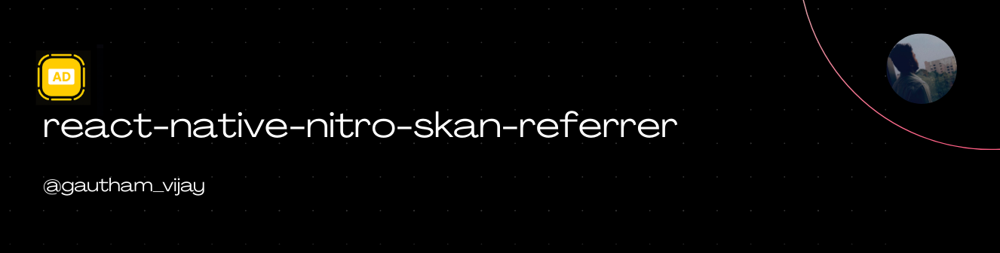

<a href="https://gauthamvijay.com">
  <picture>
    
  </picture>
</a>

# react-native-nitro-skan-referrer

A **React Native Nitro Module** providing a unified API for:

* 🟢 **Google Play Install Referrer** (Android)
* 🔵 **Apple SKAdNetwork Conversion Value Updates** (iOS)

This library gives you a clean, modern, fully type-safe bridge to attribution signals across both mobile ecosystems.

---

> [!IMPORTANT]
>
> * Tested only on React Native **0.81+** with Nitro Modules.
> * Install Referrer requires **Google Play Store** (not available on emulators).
> * SKAdNetwork APIs require **iOS 14+** (basic) and **iOS 16.1+** (postback conversions).

---

## 📦 Installation

```bash
npm install react-native-nitro-skan-referrer react-native-nitro-modules
```

> [!NOTE]
> This package ships a hybrid iOS + Android implementation using Nitro Modules.
> iOS supports **SKAdNetwork** conversion values.
> Android supports the **Install Referrer API**.

---

## 🧠 Overview

| Platform    | API Used                            | Purpose                                                     |
| ----------- | ----------------------------------- | ----------------------------------------------------------- |
| **Android** | Google Play Install Referrer API    | Retrieve install referrer, timestamps, instant install flag |
| **iOS**     | SKAdNetwork (14.0–16.1+ variations) | Update SKAN conversion values & postback conversion values  |

---

## Configuration

### **iOS**

If you’re using SKAdNetwork postback APIs (iOS 16.1+), ensure the appropriate Apple SKAN entries exist in your **`Info.plist`** or entitlement file as required by your ad network.

No custom entitlements are required for this library.

### **Android**

No extra setup required — but:

> ✔ The device **must have Google Play Store installed**
> ✔ The app must be downloaded via Play Store for true referrer values
> ✔ API does NOT work on AOSP emulator

---

## ⚙️ Usage

```tsx
import { useEffect, useState } from 'react';
import {
  View,
  Text,
  Button,
  ScrollView,
  Platform,
  ActivityIndicator,
} from 'react-native';

import {
  getInstallReferrer,
  registerAppForAdNetworkAttribution,
  updateConversionValue,
  updatePostbackConversionValue,
} from 'react-native-nitro-skan-referrer';

export default function App() {
  const [result, setResult] = useState<any>(null);
  const [loading, setLoading] = useState(false);
  const [error, setError] = useState<string | null>(null);

  const fetchReferrerOrSkan = async () => {
    setLoading(true);
    setError(null);

    try {
      if (Platform.OS === 'android') {
        const data = await getInstallReferrer();
        setResult(data);
      } else {
        await registerAppForAdNetworkAttribution();

        // Update SKAN fine value
        const res = await updateConversionValue(12);

        // Or update postback values (iOS 16.1+)
        // const res = await updatePostbackConversionValue(12, 'high', true);

        setResult(res);
      }
    } catch (err: any) {
      console.error(err);
      setError(err?.message ?? 'Unknown error occurred');
    } finally {
      setLoading(false);
    }
  };

  return (
    <View style={{ padding: 20, flex: 1 }}>
      <Text style={{ fontSize: 22, fontWeight: '700', marginBottom: 20 }}>
        {Platform.OS === 'android'
          ? 'Install Referrer Demo'
          : 'SKAdNetwork Demo'}
      </Text>

      <Button title="Run Test" onPress={fetchReferrerOrSkan} />

      <View style={{ marginTop: 20, flex: 1 }}>
        {loading ? (
          <ActivityIndicator size="large" />
        ) : error ? (
          <Text style={{ color: 'red' }}>{error}</Text>
        ) : (
          <ScrollView>
            <Text>{JSON.stringify(result, null, 2)}</Text>
          </ScrollView>
        )}
      </View>
    </View>
  );
}
```

---

## 🧩 API Reference

### **Android Install Referrer**

```ts
getInstallReferrer(): Promise<{
  success: boolean;
  data?: {
    installReferrer: string;
    referrerClickTimestampSeconds: number;
    installBeginTimestampSeconds: number;
    referrerClickTimestampServerSeconds: number;
    installBeginTimestampServerSeconds: number;
    googlePlayInstantParam: boolean;
    installVersion?: string;
  };
  error: string;
  errorMessage?: string;
}>
```

---

### **iOS SKAdNetwork**

#### Register App

```ts
registerAppForAdNetworkAttribution(): Promise<SKANConversionResult>;
```

#### Update Conversion Value (iOS 14+)

```ts
updateConversionValue(fineValue: number): Promise<SKANConversionResult>;
```

#### Update Postback Conversion Value (iOS 16.1+)

```ts
updatePostbackConversionValue(
  fineValue: number,
  coarseValue: 'high' | 'medium' | 'low',
  lockWindow: boolean
): Promise<SKANConversionResult>;
```

---

## 🧩 Supported Platforms

| Platform          | Status                 |
| ----------------- | ---------------------- |
| **Android**       | ✅ Supported            |
| **iOS 14–16.1+**  | ✅ Supported            |
| **iOS Simulator** | ⚠️ SKAN not supported  |
| **AOSP Emulator** | ❌ Install Referrer N/A |

---

## 🤝 Contributing

PRs welcome!

* [Development Workflow](CONTRIBUTING.md#development-workflow)
* [Sending a PR](CONTRIBUTING.md#sending-a-pull-request)
* [Code of Conduct](CODE_OF_CONDUCT.md)

---

## 🪪 License

MIT © [**Gautham Vijayan**](https://gauthamvijay.com)

---

Made with ❤️ and [**Nitro Modules**](https://nitro.margelo.com)

---